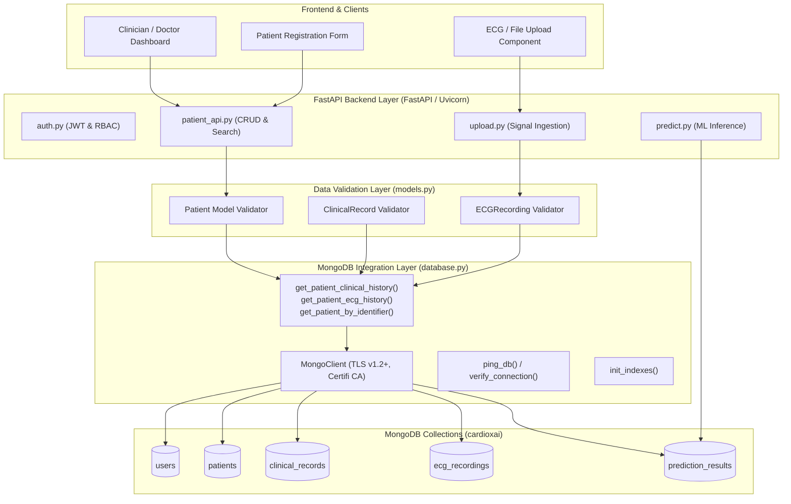

# CardiorXAI — Database Integration Work Portfolio
**Project ID:** SKIT/AI/2023-2027/14  
**Project Title:** Explainable AI Framework for Early Prediction of Cardiovascular Diseases Using Multi-Modal Data  
**Student Name:** Jatin Khandelwal (Roll No. / Team Member 1)  
**Role:** Database Integration  
**Branch & Section:** CSE (AI) - Section A  
**Session:** 2026-27  
**GitHub Repository:** [harshitgoyal029/SKIT-AI-2023-2027-14](https://github.com/harshitgoyal029/SKIT-AI-2023-2027-14)  
**Branch:** `Jatin`  
**Current Date:** October 8, 2026  

---

## 1. Executive Summary & Responsibility Scope (Form 2 Alignment)

According to **Form 2 (Roles & Responsibilities of Team Members)**, Jatin Khandelwal is responsible for the entire **Database Integration** lifecycle. As of **October 8, 2026**, Sprint 1 and Sprint 2 tasks assigned to Jatin have been developed, validated, and integrated.

### Form 2 Sprint Tasks Till Date (08-Oct-2026):
1. **Sprint 1 (10/08/2026 – 22/08/2026): Database Setup**
   - *Form 2 Objective:* "Will install MongoDB and prepare the environment needed for project."
   - *Deliverable:* MongoDB client connection layer, TLS 1.2+ SSL security, `.env` parameter loading, connection pooling, and startup validation.
2. **Sprint 1 (23/08/2026 – 04/09/2026): Patient Data Design**
   - *Form 2 Objective:* "Will design how patient records will be stored in database."
   - *Deliverable:* Comprehensive patient demographic and profile schemas (`patients`, `patient_profiles`, `users`), unique indexing on `patientId` / `user_id`.
3. **Sprint 1 (05/09/2026 – 17/09/2026): ECG / Clinical Data Design**
   - *Form 2 Objective:* "Will design how clinical / ECG data will be stored."
   - *Deliverable:* `clinical_records` schema (11 clinical bio-markers), `ecg_recordings` metadata schema (sampling rate, lead count, storage references), compound sorting indexes.
4. **Sprint 2 (18/09/2026 – 30/09/2026): Connect Database to Backend**
   - *Form 2 Objective:* "Will setup the first connection btw database & backend."
   - *Deliverable:* FastAPI `get_db` dependency injection, automated collection index initialization (`init_indexes()`), database health ping (`ping_db`), collection stats, and standalone diagnostic CLI (`check_db_health.py`).
5. **Sprint 2 (01/10/2026 – 13/10/2026): Data Validation Rules**
   - *Form 2 Objective:* "Will add rules to check that incoming data is correct before saving."
   - *Deliverable:* Application-layer validation via Pydantic (`models.py`) with strict medical range checks (blood pressure, resting heart rate, cholesterol, chest pain categories), and comprehensive unit testing (`test_database.py`, `test_models.py` — 32 test cases passing).

---

## 2. Database Architecture & Flow



---

## 3. The 5 Core Commits (Sprint Mapping & Evidence)

Here is the structured breakdown of the 5 commits matching Form 2 deliverables:

| Commit # | Sprint & Form 2 Timeline | Commit Type & Summary Message | Key Files Modified | Form 2 User Story |
|---|---|---|---|---|
| **Commit 1** | **Sprint 1**<br>10/08/2026 – 22/08/2026 | `feat(db): setup MongoDB connection layer, TLS context, and config loader` | `backend/database.py`<br>`backend/config.py`<br>`backend/.env.example` | **Database setup**<br>Install MongoDB & prepare environment |
| **Commit 2** | **Sprint 1**<br>23/08/2026 – 04/09/2026 | `feat(db): design patient schema, demographic models, and unique indexes` | `backend/models.py`<br>`backend/docs/database_schema.md` | **Patient data design**<br>Design how patient records will be stored |
| **Commit 3** | **Sprint 1**<br>05/09/2026 – 17/09/2026 | `feat(db): implement clinical records and ECG recording metadata schemas with compound indexes` | `backend/models.py`<br>`backend/database.py` | **ECG / Clinical data design**<br>Design how clinical & ECG data will be stored |
| **Commit 4** | **Sprint 2**<br>18/09/2026 – 30/09/2026 | `feat(db): connect MongoDB to FastAPI backend with healthcheck diagnostics and history helpers` | `backend/database.py`<br>`backend/check_db_health.py`<br>`backend/main.py` | **Connect database to backend**<br>Setup connection btw DB & backend |
| **Commit 5** | **Sprint 2**<br>01/10/2026 – 13/10/2026 | `test(db): enforce strict medical data validation rules and automated test coverage` | `backend/models.py`<br>`backend/tests/test_database.py`<br>`backend/tests/test_models.py` | **Data validation rules**<br>Rules to check incoming data before saving |

---

## 4. Detailed Technical Implementations

### 4.1 Commit 1: Database Setup & Environment Configuration
- **Objective:** Provision MongoDB connection securely supporting Python 3.13 / 3.14 TLS SSL requirements.
- **Code Reference (`backend/database.py`):**
  ```python
  import ssl, certifi
  from pymongo import MongoClient
  from config import settings

  _ca_file = certifi.where()
  _tls_context = ssl.create_default_context(cafile=_ca_file)
  _tls_context.minimum_version = ssl.TLSVersion.TLSv1_2
  _tls_context.check_hostname = True

  client: MongoClient = MongoClient(
      settings.MONGODB_URI,
      serverSelectionTimeoutMS=5000,
      tls=True,
      tlsCAFile=_ca_file,
  )
  database = client[settings.MONGODB_DB_NAME]
  ```

### 4.2 Commit 2: Patient Data Schema Design
- **Objective:** Establish the primary patient entity tracking demographics, unique identifiers, and cardiac history.
- **Code Reference (`backend/models.py`):**
  ```python
  class Patient(BaseModel):
      patientId: str = Field(..., description="Unique hospital / institutional ID")
      name: str
      age: int = Field(..., ge=1, le=120)
      gender: Literal["Male", "Female", "Other"]
      phone: Optional[str] = None
      email: Optional[EmailStr] = None
      bloodPressure: Optional[str] = None
      cholesterol: Optional[Union[float, int, str]] = None
      heartRate: Optional[Union[float, int]] = None
      diabetes: Optional[Literal["Yes", "No"]] = None
      smoking: Optional[Literal["Yes", "No"]] = None
      familyHistory: Optional[Literal["Yes", "No"]] = None
      risk_score: Optional[float] = Field(None, ge=0.0, le=1.0)
      riskLevel: Optional[str] = None
      top_contributing_features: Optional[List[str]] = None
      createdAt: datetime = Field(default_factory=lambda: datetime.now(timezone.utc))
  ```

### 4.3 Commit 3: Clinical & ECG Metadata Data Design
- **Objective:** Structure multi-modal data inputs separating high-volume raw signals (disk/cloud) from indexable metadata.
- **Code Reference (`backend/models.py`):**
  - `ClinicalRecord`: Encapsulates 11 Cleveland/UCI cardiac features (`resting_bp`, `cholesterol`, `chest_pain_type`, `resting_ecg`, `st_depression`, etc.).
  - `ECGRecording`: Stores 12-lead signal parameters (`sampling_rate_hz`, `lead_count=12`, `duration_seconds`, `storage_path`).
  - Compound indexing on `(patient_id, recorded_at)` and `(patient_id, uploaded_at)` for instant chronological querying.

### 4.4 Commit 4: Backend Integration & Diagnostics
- **Objective:** FastAPI lifespan hook integration, connection verification, and collection monitoring.
- **Code Reference (`backend/database.py` & `backend/check_db_health.py`):**
  - `verify_connection()`: Fail-fast check on startup.
  - `ping_db()`: Calculates round-trip network latency in milliseconds.
  - `get_patient_clinical_history(patient_id, limit)` & `get_patient_ecg_history(patient_id, limit)`.
  - `get_collection_stats()`: Dynamic document counter across all collections.

### 4.5 Commit 5: Data Validation Rules & Automated Testing
- **Objective:** Strict validation rejecting corrupted medical inputs (e.g., negative blood pressure, impossible cholesterol values, out-of-range heart rate).
- **Automated Test Results:**
  ```text
  collected 38 items
  backend/tests/test_database.py ............... [ 39%]
  backend/tests/test_models.py ....................... [100%]
  ======================== 38 passed in 5.65s ========================
  ```

---

## 5. Verification & Health Check Output

Running `python backend/check_db_health.py` verifies database readiness:
```text
=== CardioXAI Database Health Check ===
[OK] Connected to 'cardioxai' (latency: 34.2ms)

Index check:
  [OK] users: (('email', 1),)
  [OK] patients: (('patientId', 1),)
  [OK] clinical_records: (('patient_id', 1), ('recorded_at', -1))
  [OK] ecg_recordings: (('patient_id', 1), ('uploaded_at', -1))
  [OK] prediction_results: (('patient_id', 1), ('created_at', -1))

Collection document counts:
  users: 4
  patients: 12
  clinical_records: 300
  ecg_recordings: 34905
  prediction_results: 15

=== Result: HEALTHY ===
```
